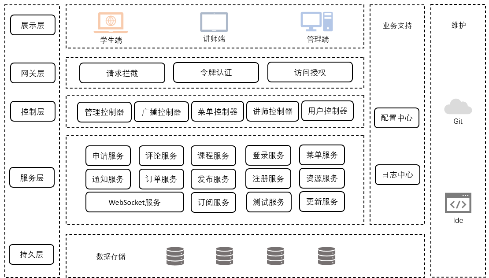
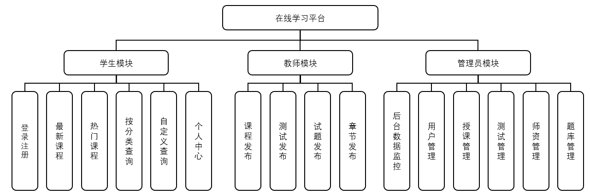
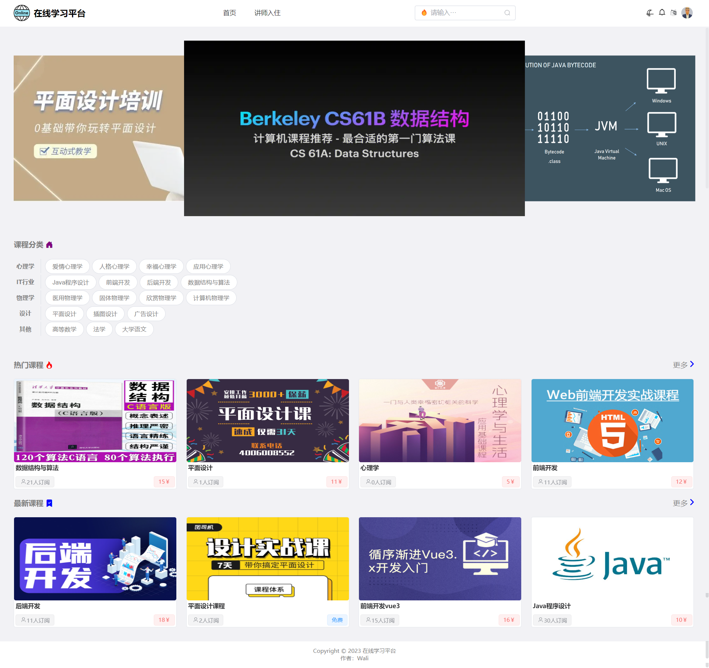
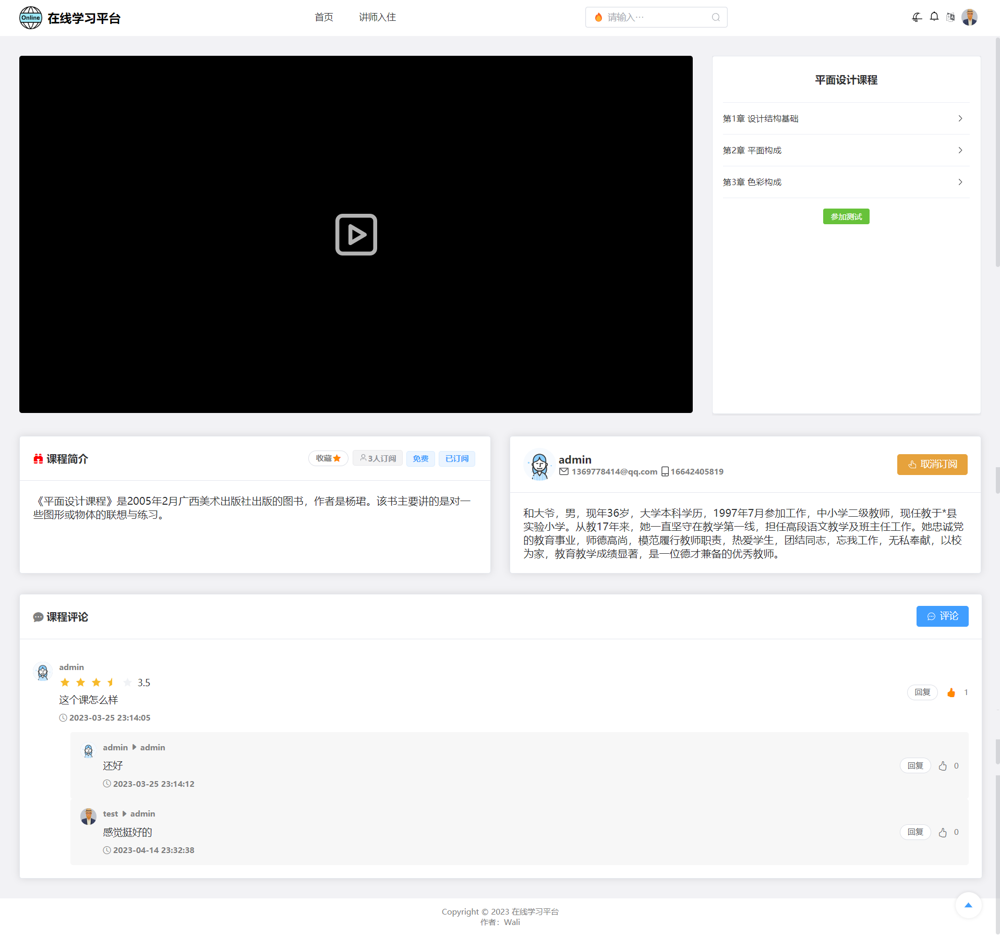
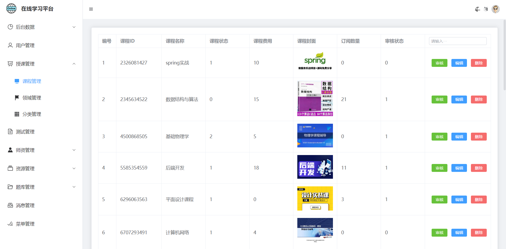

# 平台介绍
在线学习平台(onlinelearn platform)是基于SSM的，前后端分离的Java Web项目，平台的整体架构属于微服务架构。本平台架构的层级有五个，分别是持久层、服务层、控制层、网关层和展示层。服务层提供了本平台所需要的所有微服务，控制层只需要去调用微服务去处理请求，如下图所示

# 平台功能
在线学习平台的功能模块比较多，比较重要的有注册登录、发布课程和授课管理等。比较详细的功能如下图所示（部分）

# 运行效果
界面比较多，就不一一放了，感兴趣的小伙伴去仓库拉下代码自己跑一下。废话少说，上图！

学生首页

课程学习

后台管理

# 相关命令
加载依赖: ``mvn install``
